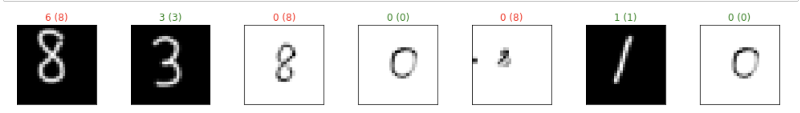

# Weekly report 2

## To do:
```python
torch.utils.data.sampler.SubsetRandomSampler
```
- I don't know what's this function is doing. Sampling for what? Here is the [documentation:](https://pytorch.org/docs/stable/data.html)
Samples elements randomly from a given list of indices, without replacement. 

- Why do we need a testloader or validation-loader if they don't need to be computed
in batches. Can we just have a group of giant set of data and test it?

- What does normalize function do in the transform for a RGB image?

- screen -x session_name to resume (reattach) a session knowing its name

- Combine a way to show realtime digit recongnition.

### Finished:

-[x] You actually can't resize the image size in markdown. If you want to you can edit the 
css file so that you can change the size.

-[x] I applied a 2 conv layers into the mnist again. While the model reached 99% on the training set,
it also gave 4 correct output out of 7 compared to last week, 2 out of 7. Interestingly,
all the digits 8 got misclassified. I have to say the last digit 8 was badly drawn which 
might impact the model judgement. It's just 7 samples not large enough to draw a conclusion.
I am visioning to build a little program, so when I demonstrate my work, the audience can come to the
computer, draw a digit on the screen and get a prediction from the model.


## Parameters Sharing

## Zero padding has a more general formula from  Stanford's cs231n course):
We can compute the spatial size of the output volume as a function of the input volume size (W), the kernel/filter size (F), the stride with which they are applied (S), and the amount of zero padding used (P) on the border. The correct formula for calculating how many neurons define the output_W is given by (W−F+2P)/S+1.

## nn.Conv2d
It can keep the original size of the image and stack different features maps.