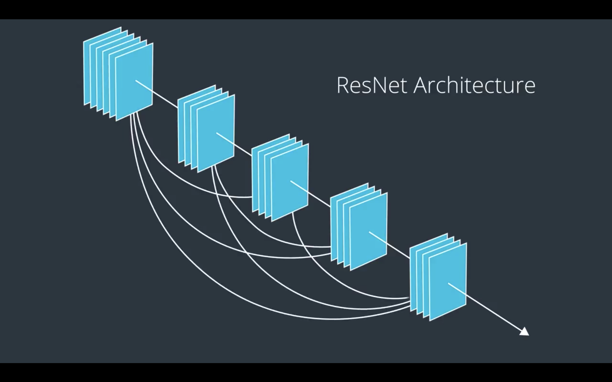
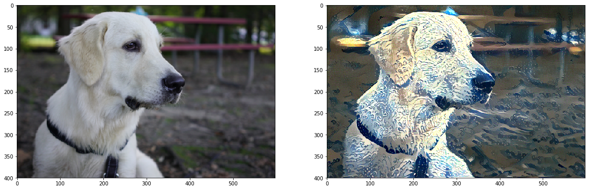
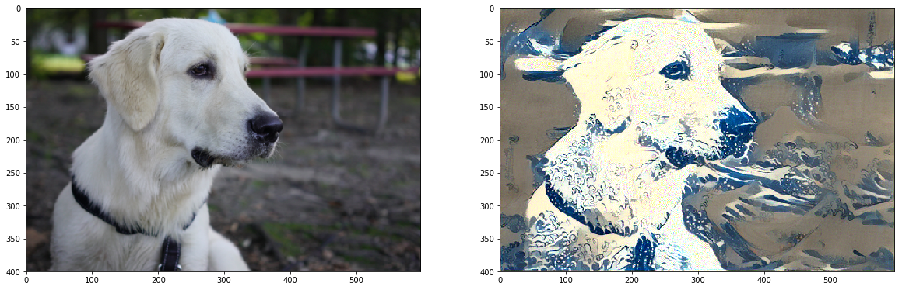

# Weekly report 2

## To do:
```python
torch.utils.data.sampler.SubsetRandomSampler
```
- I don't know what's this function is doing. Sampling for what? Here is the [documentation:](https://pytorch.org/docs/stable/data.html)
Samples elements randomly from a given list of indices, without replacement. 

- Why do we need a testloader or validation-loader if they don't need to be computed
in batches. Can we just have a group of giant set of data and test it?

- What does normalize function do in the transform for a RGB image?

- screen -x session_name to resume (reattach) a session knowing its name

- Combine a way to show realtime digit recongnition.

- I think it would be interesting to do a visualization of a style transfer process. Save the output every 
5 steps, and generate a video from that.


### Finished:

-[x] You actually can't resize the image size in markdown. If you want to you can edit the 
css file so that you can change the size.

-[x] I applied a 2 conv layers into the mnist again. While the model reached 99% on the training set,
it also gave 4 correct output out of 7 compared to last week, 2 out of 7. Interestingly,
all the digits 8 got misclassified. I have to say the last digit 8 was badly drawn which 
might impact the model judgement. It's just 7 samples not large enough to draw a conclusion.
I am visioning to build a little program, so when I demonstrate my work, the audience can come to the
computer, draw a digit on the screen and get a prediction from the model.


## Parameters Sharing

## Zero padding has a more general formula from  Stanford's cs231n course):
We can compute the spatial size of the output volume as a function of the input volume size (W), the kernel/filter size (F), the stride with which they are applied (S), and the amount of zero padding used (P) on the border. The correct formula for calculating how many neurons define the output_W is given by (W−F+2P)/S+1.

## nn.Conv2d
It can keep the original size of the image and stack different features maps.

## Layers
It's a interesting question of how many layers I should decided for my CNNs. Intuitively, the 
deeper the network is, the better it can predict. But, it's quitely travial. Let me quickly go through the 
development of CNNs:

- 2012, [Alexnet](http://papers.nips.cc/paper/4824-imagenet-classification-with-deep-convolutional-neural-networks.pdf) achieved a groundbreaking result by using 11 * 11 kernel, dropout to avoid overfitting,
reLu activation function. It took them a week to train the network.

- 2014, [VGGNets](https://arxiv.org/pdf/1409.1556.pdf) pioneered the 3 * 3 convolutions, 2 * 2 pooling layers, finishing with 3 dense layers. (They also
managed to use multiple GPUs at the same time. 3.75 speed up when using 4 GPUs.)

- 2015, [ResNet](https://arxiv.org/pdf/1512.03385v1.pdf) was famous for its 152 layers. Having too many layers before can negatively impact the prediction 
accuracy quickly. The reason is that the deeper the network becomes, the signal gets weakened before it gets where
it should goes. It's also called Vanishing Gradient's problem. ResNet team came up
with a idea to skip some of the layers so the gradients have shorter routes to
travel.

## Visualize CNN layers
[Demos of CNN layers](https://classroom.udacity.com/courses/ud188/lessons/b1e148af-0beb-464e-a389-9ae293cb1dcd/concepts/86518a21-c85a-400b-a50c-8705ed93ca83)

### Realtime package
[OpenFremeworks](https://openframeworks.cc/download/) is a real time visualization of your CNN.

## Style transfer
I realized that how style transfer has the same strategy for Generative Adversarial
Network. Here is the original paper: [Style Transfer Generative Adversarial Networks: Learning to Play Chess Differently](https://arxiv.org/abs/1702.06762)

### Results:

I've successfully created two more examples with my dog Yeti.

Low style weight:(1e7)


High style weight:(1e8)

I can change the weights for content and style so you can see the 
result looks more stylized.

