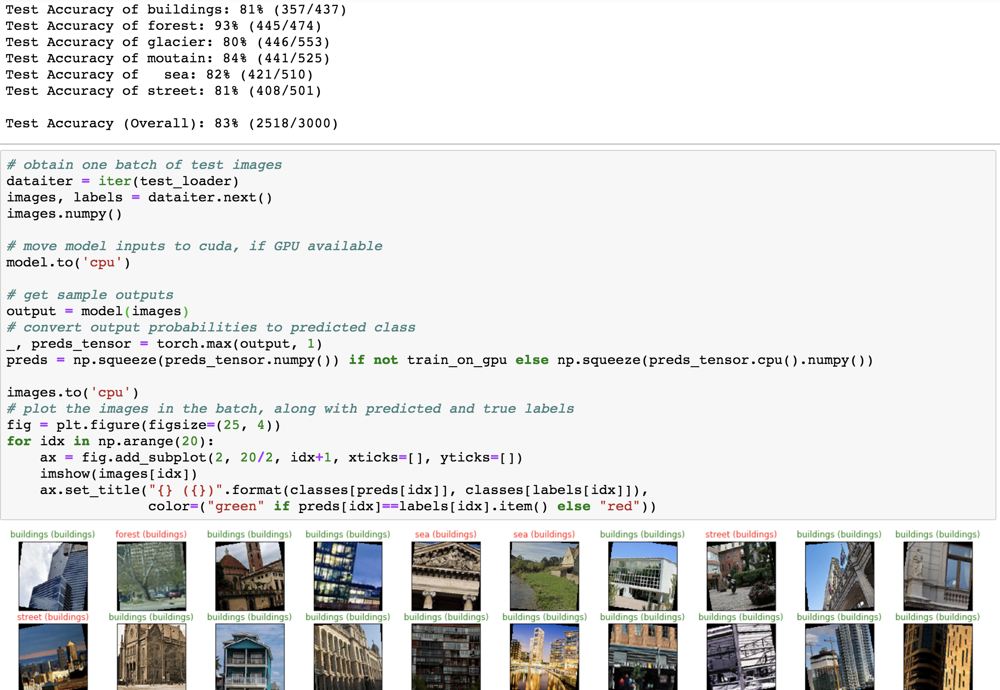

# Weekly report 3

## To do
- [ ] Size of latent vector is 100 from the solution but it's unclear to me.
Is that a arbitrary number?

- [ ] How to decide a good batch size?(The bigger the better if you can feed them into the GPU ram)

- [ ] How to decide the normalized number?


## Speed up

Half precision is a good contributor to speed up.[Link](https://discuss.pytorch.org/t/training-with-half-precision/11815/2)
```python
model.half()  # convert to half precision
for layer in model.modules():
  if isinstance(layer, nn.BatchNorm2d):
    layer.float()
```
## Generative Adversarial Network

### Leaky ReLU


## Intel Image Classification

I started to test my CNN skills on a image dataset called Intel Image
Classification. My first attempt got 83% accuracy overall.


However, the accuracy stopped incresing for my current layer setup. After trying a few more times,
I started to look at the kernel from Kaggle.
