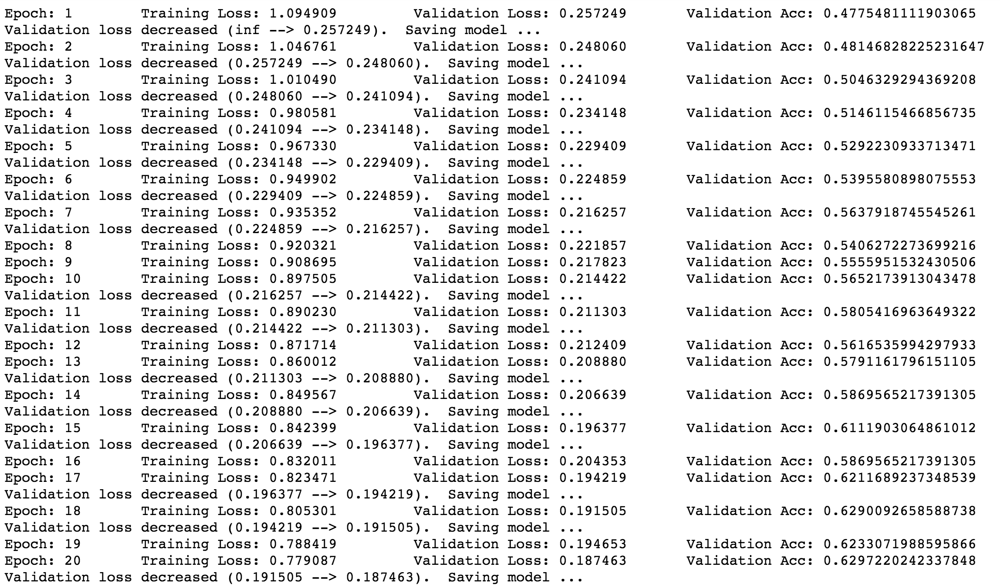

# Weekly report 4

## Handy tools

- [x] If you try to run the training multiple times, use the function below to clear the cache in gpu so you can free up
 some memory.
```Python
torch.cuda.empty_cache()
```

## To do

- [ ] Imporve my model to 90% accuracy

- [ ] Get more computation resource. If I use 244 by 244 pixel size with 128 batch size, then it's going to take the whole 11
GB vram and takes two hours for a single run. I think getting two RTX 2080 for the school would be great, because it support the latest [NVLink](https://blog.inten.to/hardware-for-deep-learning-part-3-gpu-8906c1644664) connection, which can
 let two gpu share the vram between each other. Luckily, the Pytorch is supporting the technology with [NCCL](https://docs.nvidia.com/deeplearning/dgx/pytorch-release-notes/rel_17.05.html). Maybe I can apply a CBD funding for that? 

### Finished:

- [x] I found this [paper](https://arxiv.org/abs/1609.04836) talking about how large batch-size has
negative impact on training performance.
    - SGD has a drawback of being unalbe to parallelize due to the smaller batch size. That's why people 
    are trying to use bigger batch-size.
    


### Model modification:

- [x] Here is my DNN structure for that 83% accuracy:

    I tried to tune with different parameters but the accuracy seemed not improving at all. So I tried to get some idea 
    from other kaggle kernal.
    This is the structure I got from a [Kaggle user](https://www.kaggle.com/twhitehurst3/intel-classification-keras-cnn-92-acc)
    :

Interesting thing is that I copy the whole model structure and training batch size, the accuracy I got from this copy model 
is 79%. From the kernal post, I saw this user's training model got 82% accuracy from the first epoch of training and
ended up at 92%. I looked few other posts and they all got very high validation accuracy at the first training epoch. I
think maybe my method to calculate the validation accuracy is wrong. In training, my validation accuracy started at 47%,
then steady increased. The validation accuracy was only 62% at the end of the training,
but the test accuracy is 79%. There is huge difference between my training and testing. Is it underfit? I need to do more test next week.

-[x] While working on that intel dataset, I also found the [fruit-360](https://www.kaggle.com/moltean/fruits) dataset. It seems
some people are using Pytorch on this dataset. I will give it a try next week and improve my model based on other's kernel.


    