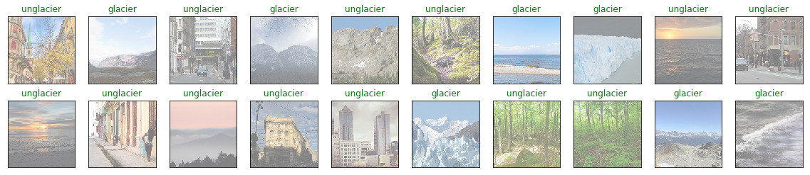

# Weekly report 5 

## New idea
I think mulitple-binary classification model could be a way to spped up the 
training process. I will conduct some experienment on them. See if I get a speed up.

### First result

• The result is compling! I got 97% accuray on the forest group for the binary training model. It beat my previous best 
93% model. It also took 30 epoches to train. However, when I use this model to predict the new unlabel data. It's kind 
of random. I realized that I can't use two different class for binary training. The model is not robust enough. I need to 
have a forest folder and shuffle all five images class into not forest folder.


• I modified the dataset a little bit and the result is even better! I got 87% accuracy for glacier and 96% for non-glacier.
This is the best I got so far. For the non-label predicting, it gives better duarbility than the previous one.



## Handy tools

• Use ... to count how many files in a directory
```bash
ls -1 | wc -l
```