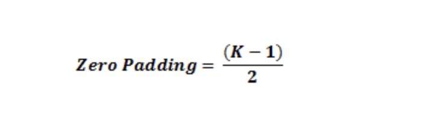
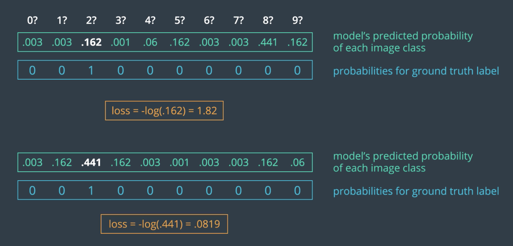
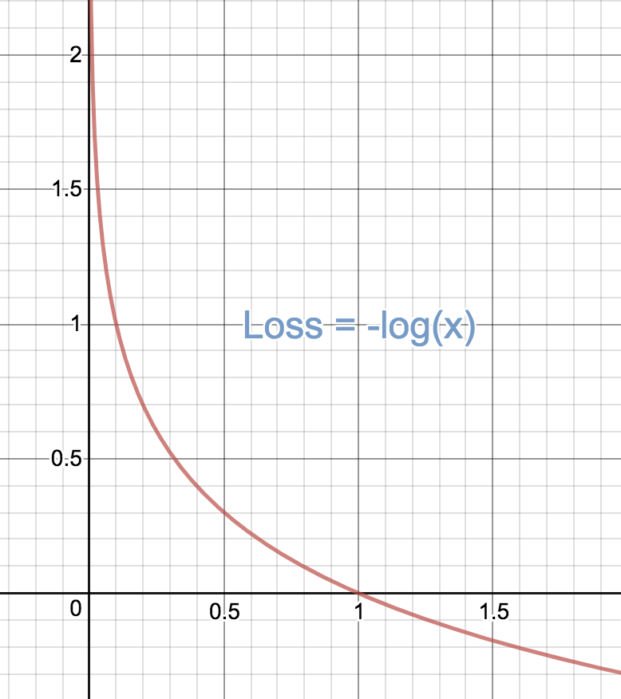
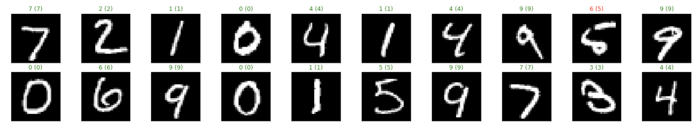
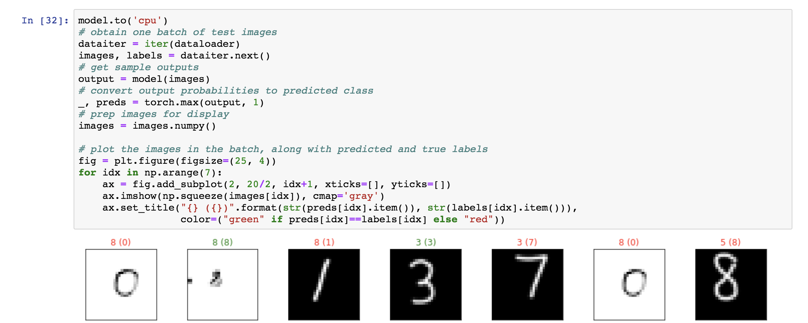

# Weekly report 

## To do:
- [ ] find a way to resize image in markdown

## Miscellaneous materials:
- [First drop-out method paper](https://www.cs.toronto.edu/~hinton/absps/JMLRdropout.pdf)
- [Markdown cheatsheet](https://github.com/adam-p/markdown-here/wiki/Markdown-Cheatsheet)
- [fix loading self-created images](https://github.com/pytorch/examples/issues/236)

## Zero padding:

- To overcome information loss at the edge of images(preserve the size of the original input):
(where K is the size of filter)


## Max pooling:
- Reducing computational load
- Reducing overfitting by only save the relative location of the activation instead of exact location


## Loss function:
- Cross-entropy loss:


The reason for using -log is when the prediction is close to 1(100%), it gives 0 for the loss

## Log-softmax:
- It’s easier to push the loss bigger. Here is an example of that:

Let’s consider a case were your true class is 1 and your model estimates the probability of the true class is .9. If your loss function is the L1 Loss function, the value of the loss function is 0.1. On the other hand, if you are using the log-likelihood then the value of the loss function is 0.105 (assuming natural log).

On the other hand, if your estimated probability is 0.3 and you are using the likelihood function the value of your loss function is 0.7. If you are using the log-likelihood function the value of your loss function is 1.20.

Now if we consider these two cases, using the standard likelihood function (akin to softmax), the error increases by a factor of 7 (.7/.1) between those two examples. Using the log-likelihood function (akin to log-softmax) the error increases by a factor of ~11 (1.20/.105). The point is, even though logsoftmax and softmax are monotonic, their effect on the relative values of the loss function changes. Using the log-softmax will punish bigger mistakes in likelihood space higher.

- Log-softmax works better with Cross-entropy, cancel exponent:


## Drop out
- Drop out randomly shuts down some of the nodes in the layers, by doing that, we can 
skip some nodes which have really great weights. This gives every nodes a chance to get trained
- In Pytorch, model.eval() turn offs the drop out, and model.train() open that back on.
- I forgot to use the dropout for the first couple of times. It performed very poorly. One out 
of six times it can give 96% accuracy. In other word, if you don't use dropout, it's very based on how random those 
weights are initialized.

### Handy tools
- Visualize prediction rightness
```python

# obtain one batch of test images
dataiter = iter(test_loader)
images, labels = dataiter.next()

# get sample outputs
output = model(images)
# convert output probabilities to predicted class
_, preds = torch.max(output, 1)
# prep images for display
images = images.numpy()

# plot the images in the batch, along with predicted and true labels
fig = plt.figure(figsize=(25, 4))
for idx in np.arange(20):
    ax = fig.add_subplot(2, 20/2, idx+1, xticks=[], yticks=[])
    ax.imshow(np.squeeze(images[idx]), cmap='gray')
    ax.set_title("{} ({})".format(str(preds[idx].item()), str(labels[idx].item())),
                 color=("green" if preds[idx]==labels[idx] else "red"))
```


- Grayscale tool from pytorch:
 ```python
 torchvision.transforms.Grayscale(num_output_channels=1)
 ```
- Using screen Command to Keep SSH Sessions Running:
```
screen
jupyter notebook --port=9999
```
 just press “Ctrl+a” immediately followed by “d”, so you can detach the screen session.
 In this case, the jupyter notebook won't get shut down after you disconnect the ssh session.
 
- Create your own mnist data and test it out:

• The model didn't work well in the dataset I drew. It need to be improved. 
    - But what suprises me is that the model correctly predict the digit 8, which was drew
    in white background, and black ink. If the whole picture is in black, it should get
    zero activation for most of the pixel. That's being said, the whole model got really
    low input but still the correct answer. Need to do more test on this.